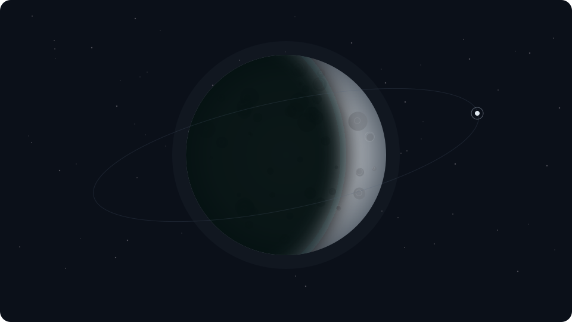

[Visit my website](https://aarush.site/) &nbsp; · &nbsp; [LinkedIn](https://www.linkedin.com/in/aarush-bhasin/)

I’m Aarush. I make interactive websites, browser games, and real-time graphics. Here are a few things I’ve made.

<table>
<tr>
<td width="50%">

<h3><a href="https://aarush.site/absence/">ABSENCE ↗</a></h3>
A black hole in your browser. Explore the observation deck, or experiment in the LAB.
</td>
<td width="50%">

<h3><a href="https://aarush.site/nightglass/">NIGHTGLASS ↗</a></h3>
An interactive Moon. Explore its phases, libration, and the surface beyond its familiar face.
</td>
</tr>
<tr>
<td width="50%">

<h3><a href="https://aarush.site/forest/enhanced.html">UNDERSTORY ↗</a></h3>
A procedural forest. Shifting light, layered foliage, and woodland sound.
</td>
<td width="50%">

<h3><a href="https://aarush.site/#work-playground">Play with this website ↗</a></h3>
Ten weapons. A destructible homepage. Break it apart, then rewind. Press <strong>Break this page</strong> to start.
</td>
</tr>
</table>

**[BREACH](https://aarush.site/breach/)** is my browser zombie shooter, inspired by the first game I made in Scratch. Desktop test build; currently paused.

### Beyond the experiments

I founded **[MisuChan](https://aarush.site/work/misuchan)** with a collaborator and led its product build. I’m also a co-founder of **[BuzzRush](https://aarush.site/work/buzzrush)**, where I worked on the website and product prototypes. BuzzRush is still in R&D.

Learning app development. Usually listening to music. Away from the screen: trekking, cycling, books, cooking, and Louie.
