  <a href="https://aarush.site/">Explore my portfolio</a> &nbsp; / &nbsp;
  <a href="https://aarush.site/#work">Enter a world</a> &nbsp; / &nbsp;
  <a href="https://www.linkedin.com/in/aarush-bhasin/">Let’s connect</a>

### A little about me

I’m Aarush. I make digital things you can use, explore, or play.

I’ve tried making videos, games, art, and music. These days I’m bringing that mix into websites and interactive experiences, learning what I need as I build. I care about the small things: how a gesture feels, how light moves, and whether something works as well on a phone as it does on a desktop.

**Frontend · Mobile UX · Real-time graphics · Product prototyping**

### Choose a world

| Experience | What’s inside | Step in |
| :--- | :--- | :--- |
| **ABSENCE** | A real-time Schwarzschild black hole, with a LAB for changing parameters and watching it respond. | [Explore ↗](https://aarush.site/absence/) |
| **NIGHTGLASS** | An interactive Moon: phases, libration, and the view beyond its familiar face. | [Enter orbit ↗](https://aarush.site/nightglass/) |
| **UNDERSTORY** | A procedural forest of layered foliage, shifting light, and woodland sound. | [Go beneath the canopy ↗](https://aarush.site/forest/enhanced.html) |
| **BREACH** | A browser zombie shooter rebuilt from my first game. Desktop test build; development is paused. | [Play the test build ↗](https://aarush.site/breach/) |

There’s another one hiding in plain sight: [my homepage becomes a destructible playground](https://aarush.site/#work-playground). Ten weapons, every chapter, and a rewind back to the original page.

### From experiments to products

**[MisuChan](https://aarush.site/work/misuchan)** — I founded it with a collaborator and led the browser-game platform’s product build, including its mobile experience and interface polish.

**[BuzzRush](https://aarush.site/work/buzzrush)** — As a co-founder, I worked on its technology, website, and product prototyping. Still in research and development.

### Around my GitHub

This panel shows real public events, including projects I’m exploring. Stars are not coding contributions. Generated assets update on a separate branch.

### Outside the screen

Trekking, cycling, swimming, football. Books nearby, music usually playing, and Louie somewhere in the picture. I’m also learning to build fluid, interactive apps as I make them.

---

MIND OF AARUSH &nbsp; / &nbsp; BUILT WITH CURIOSITY

